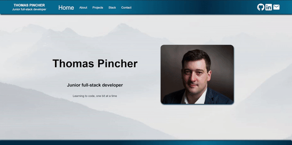

# Portfolio2

A remake of my portfolio website, 3 months on from when I first started development.

This project is hosted at https://fabulous-babka-7d489d.netlify.app/

## Requirements / Purpose

This project was to update my original portfolio - the last one had aged considerably.

I built this project in

- TypeScript
- React
- Sass

## Design Goals / Approach

One thing I have always had difficulty with was styling an app that looked like it was made after 2000. I played with verticality and a generated colour theme, along with
some more complex styling than I'd used previously to make something a little more modern.

## Features

In this rebuild I was particularly happy to move away from the HTML address tag, and went with a third party to get form submission working correctly. I'm also quite happy
with how updateable the projects section is. The project data is all kept in a file at the root level, which keeps the project code cleaner. This was a big improvement from
the massive chunks of copy inside the code from my last iteration.

## Known issues

The app is not yet mobile responsive, which will need some updating. The links at the top-right are also displaying in the wrong colour prior to being visited on some browsers.

## Future Goals

Fixing the two issues above, and maybe adding links to \_nology and udacity.

## Change logs

12/03/2024

- Initial project creation.
- Split app out into separate page routes
- Added a Navbar and styling

14/03/2024

- Attempted to implement a video player to have short .mp4 files, but could only find old library documentation. Have settled for imaged that will rotate automatically.
- Added object containing all project data and added a useEffect to call pull that data in. I've kept the project data in a separate file so that it's easy to update in the future, instead of digging through the app itself.
- Created project sliders

15/03/2024

- Restructured the project data file to be TypeScript friendly - took a bit but has been a valuable learning experience in how explicit you have to be with TS.

16/03/2024

- Updated the 'projects' page to by more dynamic
- Fixed issue with skill 'chips' on 'projects' page not displaying properly
- Fixed github link graphical issue

17/03/2024

Major overhaul of site styling - feedback was that it looked dated so I had to spend hours looking at more modern websites.
There's still a lot that I don't know how to do, but added:

- dynamic box shadowing
- changed the colour-palette
- updated all pages to reduce element width
- updated the 'stack' and 'about' pages in particular to use a 'pillar' concept
- Added in icons on the 'stack' page
- Added partials folder with website palette and changed styling files, almost entire website palette can now be updated from this file.
- Went through and consolidated components, managed to remove half of them

18/03/2024

- Managed to build the project in a way that will allow Netlify to display the images. It's meant a bit of a restructure but this has been an issue for most of the cohort so I've already shared the process around.
- Have nearly finished the styling on the page, which I'm getting more and more happy with
- I could implement some testing, and I still need to route the form submission to my email address. I'm not yet sure how to do that, but it's can't be too difficult.
- Still need to flesh out some of the copy of projects and personal history.

03/04/2024

- Completed the form submission by using Formspree and have tested thoroughly.
- Some final styling before merging the code and hosting.

What did you struggle with?

- Styling still needs work, but that will come with time. This project was great to work through my understanding of TypeScript and managing form submission outcomes.
